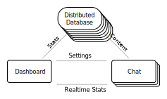

### Groningen.rb & Elixir |> Groningen

Welcome!

Wifi:<!-- .element: class="tiny-text" --> 
- SSID: Panache,<!-- .element: class="tiny-text" --> 
- password: Elixir|>Groningen<!-- .element: class="tiny-text" -->

---

Agenda

1. Announcements
2. Talk by **Marten**:
   communicating Ruby ↔ Elixir: A multilanguage webapp
3. Talk by **Marcel**: Managing side-effects with Phoenix.PubSub
4. Drinks!

---


Marten (Wiebe-Marten Wijnja**

---

## Announcements

- Code BEAM Amsterdam
- Advent of Code


---

## Communicating between Ruby ↔ Elixir: Building a multi-language app


---

### Contents

1. What is it we're building?
2. Why two languages on two systems?
3. The Past
4. The Present
5. The Future

**Ask Questions!**

---

### Planga: Seamless Chat Service


---

- _Existing_ users of your system (no external accounts)
- Chatting _between_ users
- Easy to set up, no extra bandwidth or complexity for your server.

---

Two applications:

- Chat Service
- Dashboard Service

---

### Chat Service:

- Connection handling of visitors
- Persisting and forwarding of messages

---

### Dashboard Service

- Account mamangement
  - Creating new API keys
  - Disabling old API keys
  - Enabling webhooks, etc.
- Analytics

---


### Why multiple languages/systems?

| Name                | Chat-service        | Dashboard-service                           |
|---------------------|---------------------|---------------------------------------------|
| Different end-users | Visitors that chat  | Developers that maintain their chat         |
| Concurrent users    | Thousands, Millions | Hundreds, never more than a couple thousand |
| Downtime            | Immediate problem   | 🤷                                          |
| Interaction         | Instant             | Multiple page loads is fine                 |

- Also: self-hosted Open-Source variant!

---

#### Elixir for chat-application

- Scalability
- Websockets/Phoenix Channels
- Hot-upgrades
- Fault-Tolerance

---

#### Ruby for dashboard-application

- KISS
- Replacability
- Rails is very good at building REST CRUD systems

---

### Communicating:


---

### The Past: REST calls

Simple to set up, but:

- Security! roll-your-own-encryption?!
- Polling-based, so CRON?
  - fetch everything all the time?
  - Stale info


---

### The Present: Persistent Messaging

#### RabbitMQ

- Push-based: changes get forwarded.
- Nice: 
  - Great documentation and tutorials!
  - Many different configurations of queues
- Less nice:
  - Not so clear on how to configure for production
  

---

### Aside: Security

- Setting up TLS with peer-verification is a _must_ for production systems; difficult to set up.
- XCA: GUI to make certificates.
- Terminating proxies (Nginx) to the rescue!

---

### Erlang External Term Format (ETF)

- Better fit than JSON, because:
  - 1:1 mapping of many datatypes between Ruby and Elixir:
     - Symbols/Atoms
     - BigNums
  - Compressed
  - No weird restrictions on top-level types
  - Elixir is 'host' system so it should dictate typing.

---

#### Code Examples: Ruby

```ruby
# lib/planga_app_settings_publisher.rb

# In charge of forwarding changes in the settings
# of a single application or its API-key pair(s),
# to all running Planga-Chat-app Elixir nodes.
#
# Uses RabbitMQ in Publish-Subscribe mode.
class PlangaAppSettingsPublisher
  def initialize(amqp_url)
    require 'bunny' # RabbitMQ client
    @bunny = Bunny.new(hostname: amqp_url)
    @bunny.start

    @channel = @bunny.create_channel
    @exchange = @channel.fanout('planga_app_settings_updates')
    at_exit {
      @bunny.close
      @bunny.stop
    }
  end

  # Publishes the given hashmap as a change,
  # To be read at the Elixir-side as a hashmap as well.
  private def publish_change(change_hashmap)
    require 'erlang-etf'
    message = Erlang.term_to_binary(change_hashmap)
    @exchange.publish(message)
  end

  def publish_user_change(user)
    hashmap = user.serializable_hash(
      only: [:id, :email], include: {
        api_credentials: {
          only: [:public_id, :private_key, :active]
        }
      })
    publish_change(hashmap)
  end
end

```

---


#### Code Examples: Ruby


```ruby
# config/initializers/remote_publishers.rb

require 'planga_app_settings_publisher'
PLANGA_APP_SETTINGS_PUBLISHER = PlangaAppSettingsPublisher.new(ENV["AMQP_URL"] || "localhost")

puts "Because starting up, publishing current state of User settings to all listening Planga Chat clients..."
User.all.each do |user|
  puts "Publishing #{user.id}/#{user.email}..."
  PLANGA_APP_SETTINGS_PUBLISHER.publish_user_change(user)
end
puts "Done publishing User settings to connected Planga Chat clients!"
```

---

#### Code Examples: Ruby

```ruby
# controllers/dashboard/api_keys_controller.rb

class Dashboard::ApiKeysController < Dashboard::BaseController
  def create
  
    # ... validation

    api_credential = ApiCredential.create!(user: current_user, label: params[:label][0])
    PLANGA_APP_SETTINGS_PUBLISHER.publish_user_change(current_user)

    # ... redirection
  end
end
```

---

#### Code Examples: Elixir

```elixir
# lib/planga/app_settings_listener.ex

defmodule Planga.AppSettingsListener do
  @moduledoc """
  Listens to RabbitMQ for changes in an App's settings
  (and its related API key pairs),
  """
  use GenServer
  require Logger

  def start_link do
    GenServer.start_link(__MODULE__, [], [])
  end

  @exchange_name "planga_app_settings_updates"

  def init(_opts) do
    send(self(), :setup)
    {:ok, nil}
  end


  defp rabbitmq_connect do
    case AMQP.Connection.open(config()) do
      {:ok, conn} ->
        # Be notified when the connection to RabbitMQ goes down
        Process.monitor(conn.pid)

        {:ok, channel} = setup_channel(conn)
        Logger.info "RabbitMQ connection with Ruby app established!"
        {:ok, channel}

      {:error, reason} ->
        # Reconnection loop
        Logger.warn "RabbitMQ connection to Ruby app failure... reconnecting in ten seconds!"
        Logger.warn "Reason: #{inspect(reason)}"
        :timer.sleep(5_000)
        rabbitmq_connect()
    end
  end

  defp setup_channel(connection) do
    {:ok, channel} = AMQP.Channel.open(connection)
    setup_queue(channel)
    AMQP.Basic.qos(channel, prefetch_count: 10)
    {:ok, channel}
  end

  defp setup_queue(channel) do
    AMQP.Exchange.declare(channel, @exchange_name, :fanout)
    {:ok, %{queue: queue_name}} = AMQP.Queue.declare(channel, "", exclusive: true)
    :ok = AMQP.Queue.bind(channel, queue_name, @exchange_name)
    {:ok, _consumer_tag} = AMQP.Basic.consume(channel, queue_name, nil, no_ack: true)
  end

  defp config do
    Application.fetch_env!(:planga, :amqp_settings)
  end

  def handle_info(:setup, _) do
    {:ok, channel} = rabbitmq_connect()
    {:noreply, channel}
  end

  # Reconnect on RabbitMQ failure:
  def handle_info({:DOWN, _, :process, _pid, reason}, _) do
    Logger.warn "RabbitMQ connection to Ruby app just went down! Reason:"
    Logger.warn inspect(reason)
    {:ok, chan} = rabbitmq_connect()
    {:noreply, chan}
  end

  def handle_info({:basic_consume_ok, %{consumer_tag: _consumer_tag}}, channel) do
    {:noreply, channel}
  end

  def handle_info({:basic_cancel, %{consumer_tag: _consumer_tag}}, channel) do
    {:stop, :normal, channel}
  end

  def handle_info({:basic_deliver, payload_binary, %{delivery_tag: tag, redelivered: redelivered}}, channel) do
    payload = :erlang.binary_to_term(payload_binary)
    Task.start(fn ->
      IO.puts "Received message: #{inspect(payload)}"
      update_rails_user(payload)
      IO.puts "Done updating user!"
    end)
    {:noreply, channel}
  end

```

---

### The Future: ???

- Multiple Elixir chat-nodes
  - Distributed datastore (Riak or Cassandra)
  - Potential for less communication, since analytics can be taken directly from distributed datastore.
  

---



---

### Closing Remarks

- There are other ways of communicating:
  - Elixir: Ports
  - Elixir: NIFs
  - Ruby: Open3 et al.
- but those are built for same-system host/client.
- RabbitMQ is great, SysAdmin-stuff is not.
  - Has Nice GUI!

---

### Questions?

---


## Talk by **Marcel**: Managing side-effects with Phoenix.PubSub

---

### Drinks!
Wifi:<!-- .element: class="tiny-text" --> 
- SSID: Panache<!-- .element: class="tiny-text" --> 
- password: Elixir|>Groningen<!-- .element: class="tiny-text" -->
