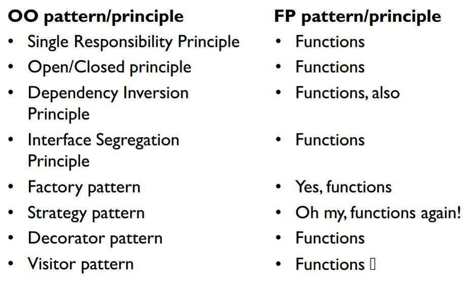

### Groningen.rb & Elixir |> Groningen

Welcome!

Wifi:<!-- .element: class="tiny-text" --> 
- SSID: Panache,<!-- .element: class="tiny-text" --> 
- password: Elixir|>Groningen<!-- .element: class="tiny-text" -->

---

Wiebe-Marten Wijnja

---

## Object-Oriented to Functional

---

---

- OOP: Attributes + Methods
  - Stateful
- Functional: Data Structures + Functions transforming them
  - Stateless

### What are Objects and Classes used for?

- Grouping Functionality (Single Responsibility)
- Data Structures
- Composition
- Inheritance

---

### Grouping Functionality

- OOP: Classes (Sometimes modules/namespaces are supported)
- Functional: use Modules

---

### Data Structures

- OOP: Objects that only have attributes
- Functional: Simple data structures that might be nested
  - Many languages allow you to create your own record datatypes.

---

### Composition

- Works the same way in OOP and Functional
- in OOP, often inheritance is used (although bad style) where Composition ought to be used.

---

### Inheritance

- OOP: top-down inheritance.

- In Functional land, two options:
  - Use a sum type (AKA 'Typed Union')
    - (A shape is `rectangle position width height | square position width | circle position radius**)
  - Use ad-hoc polymorphism:
    - Protocols/Typeclasses/Traits/Interfaces
    - Behaviours: Similar, but pass around module that knows operations manually.

---

### Referential Transparency

- Current line of code can be understood by ****only looking at the earlier lines in this function**.
- Refactoring simple

> You wanted a banana but what you got was a gorilla holding the banana and the entire jungle

---

### Related information

- [SOLID Design in Elixir - Georgina McFadyen (Presentation on ElixirConf.EU 2018)](https://www.youtube.com/watch?v=eldYot7uxUc)
- [Translating a C++ parser to Haskell - Gabriel Gonzalez (blog article on Haskell for the Masses)](http://www.haskellforall.com/2017/06/translating-c-parser-to-haskell.html)

---

### Questions?

---

### Drinks!
Wifi:<!-- .element: class="tiny-text" --> 
- SSID: Panache,<!-- .element: class="tiny-text" --> 
- password: Elixir|>Groningen<!-- .element: class="tiny-text" -->
